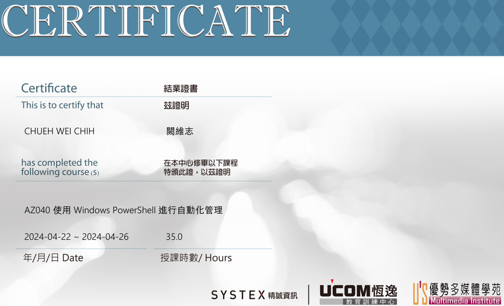
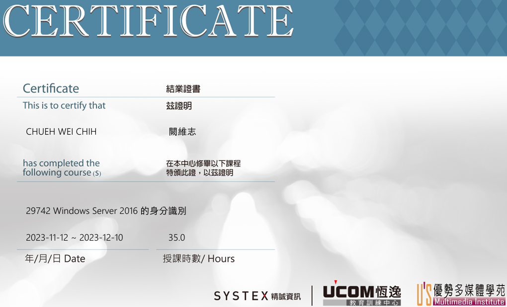
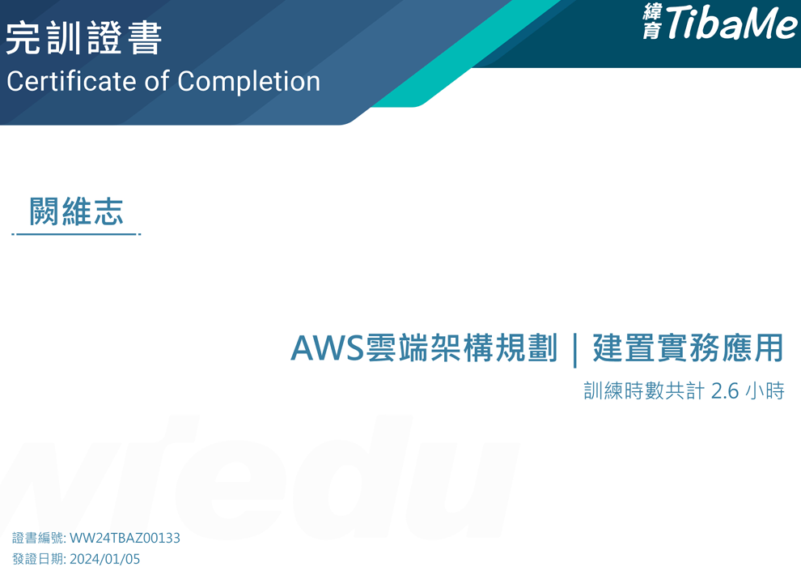
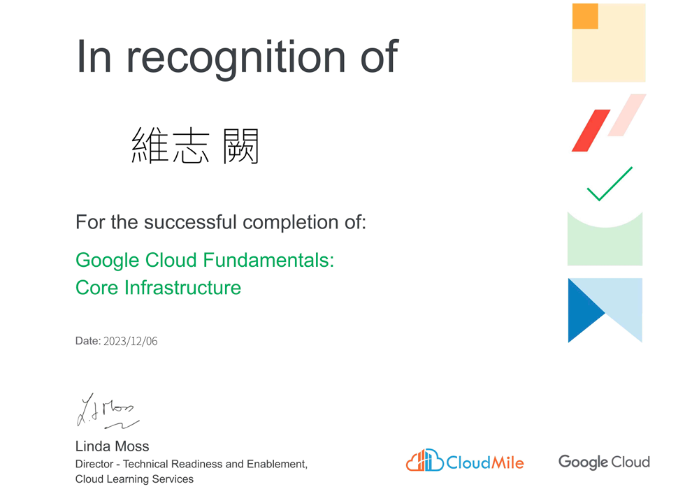
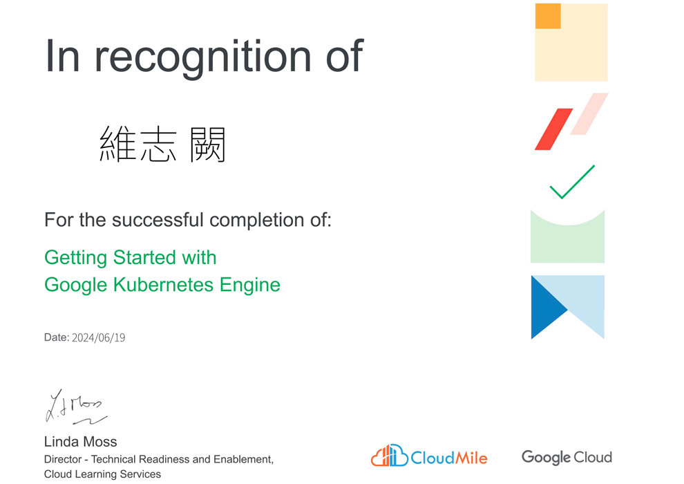

## 學習與成就

### Microsoft Certified: Azure Administrator Associate
- **內容**: 通過AZ-104考試取得此認證，針對中級 Azure 管理員，驗證您在實施、管理和監控Azure雲端身份、計算、儲存、虛擬網路和治理方面的能力。
- **學習方式**: 自主學習。
### Microsoft Certified: Azure Solutions Architect Expert
- **內容**: 通過AZ-104、AZ-305考試取得此認證，專注於設計 Microsoft Azure 基礎結構解決方案，幫助IT專業人士掌握在Azure上設計和構建企業級雲解決方案的能力。
- **學習方式**: 自主學習。
### Microsoft Certified: Azure AI Engineer Associate
- **內容**: 通過AI-102考試取得此認證，專注於設計與實作Azure上的AI解決方案。內容涵蓋語音辨識、自然語言處理、電腦視覺、知識探勘及Azure AI服務（如 Azure OpenAI、Cognitive Services）的應用整合。
- **學習方式**: 自主學習。
### Microsoft Certified: Identity and Access Administrator Associate
- **內容**: 通過SC-300考試取得此認證，專注於設計、實施和管理 Azure Active Directory（Azure AD）中的身份與存取解決方案。涵蓋身份管理、存取控制、條件式存取和身份治理等主題。
- **學習方式**: 自主學習。
### Microsoft 365 Certified: Administrator Expert
- **內容**: 通過SC-300、MS-102考試取得此認證，提升 Microsoft 365 系統管理與維護能力，涵蓋帳號管理、權限設定、群組配置、資料安全及合規性管理等操作。
- **學習方式**: 自主學習。

### [Microsoft 成績單](https://learn.microsoft.com/en-us/users/chrischueh-1427/transcript/d5o8yhw609q69gy)

### Windows PowerShell 自動化管理（AZ-040）
- **內容**: 完成 PowerShell 課程，掌握系統自動化技能，顯著提升工作效率，減少手動操作錯誤。
- **學習方式**: 實體課程。

### （29742）Windows 2016 身分識別課程
- **內容**: 涵蓋 Active Directory 服務的配置與管理。學員將學習如何安裝與設定網域控制器，管理 Active Directory Domain Services (AD DS) 系統與物件，並實施群組原則以強化安全性。課程還包括憑證服務和 AD 同盟服務的配置，幫助企業確保內部系統的安全性和效率。
- **學習方式**: 實體課程。

### AWS 雲端架構規劃與建置實務
- **內容**: 學習 AWS 雲端服務架構與資源配置，實作多個案例，了解企業高效、安全的雲端架構建立方法。
- **學習方式**: 線上課程。

### Google Cloud 核心基礎架構
- **內容**: 深入學習 Google Cloud 的核心服務，理解雲端基礎設施的運作與管理，並進行應用配置與管理。
- **學習方式**: 線上課程。

### Google Cloud Kubernetes（K8S）
- **內容**: 學習 Kubernetes 基本概念與運作方式，為容器化服務奠定基礎。
- **學習方式**: 線上課程。

### 生成式 AI 工具（Generative AI Tools）
- **內容**: 了解語言模型（如 GPT）的應用原理，熟悉其於內容生成、流程輔助與問題解決等實務場景的應用，具備基礎 Prompt Engineering 概念。
- **學習方式**: 自主學習。

### Ansible
- **內容**: 掌握 Ansible 的組態管理與自動化部署流程，能撰寫 playbook 管理伺服器設定，提升維運效率並降低人工作業風險。
- **學習方式**: 自主學習。

### Terraform
- **內容**: 熟悉基礎設施即程式碼（Infrastructure as Code, IaC）概念，能使用 Terraform 定義並自動化部署雲端資源（如 Azure、AWS）。
- **學習方式**: 自主學習。

### 軟體開發與版本控制（Git、GitHub）
- **內容**: 理解 Git 和 GitHub 應用，學會版本控制與協作開發，確保專案運作和代碼一致性。
- **學習方式**: 自主學習。
