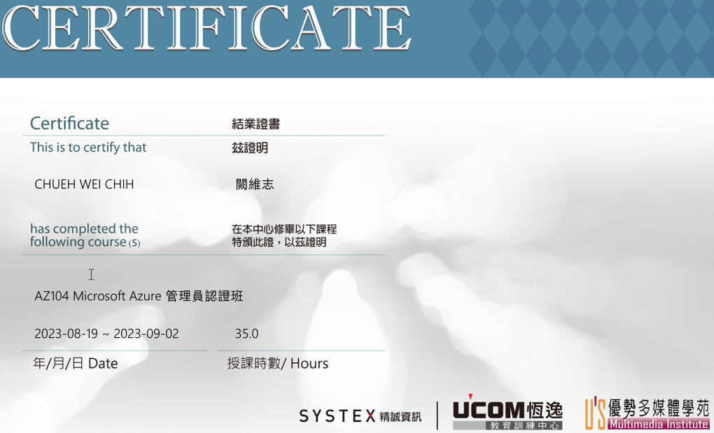
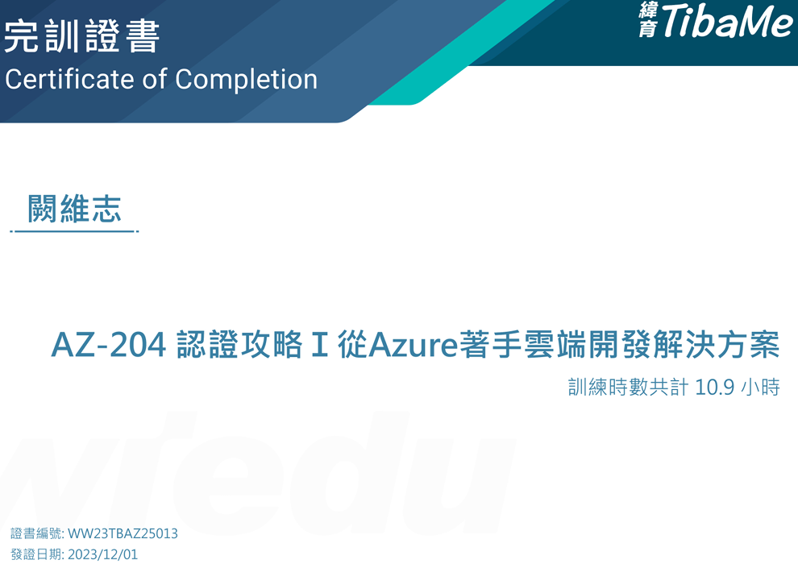
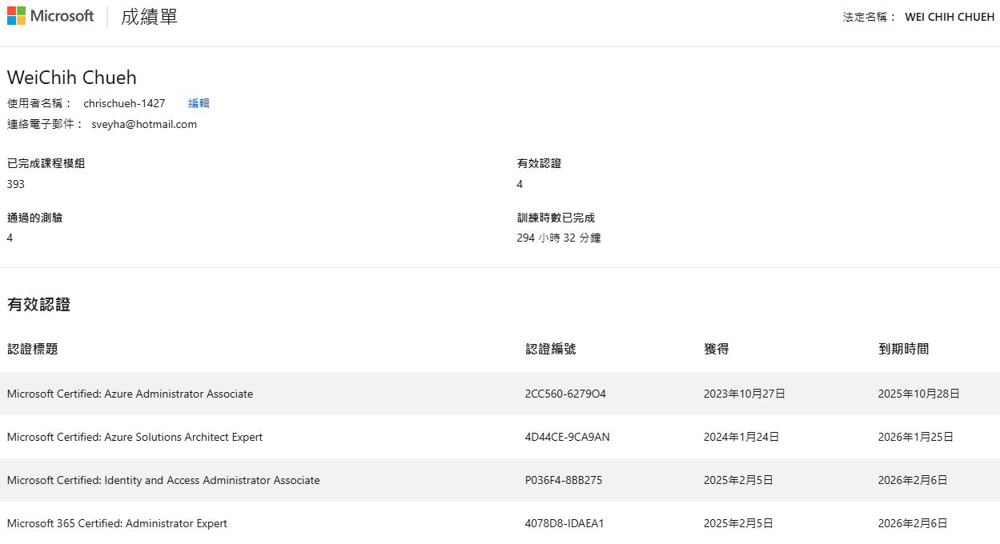

## 學習與成就

### AZ-104 課程
- **內容**: 強化對 Azure 雲端環境的管理與配置，學習維護虛擬機器、資料庫、虛擬網路等資源，提升雲端技術專業知識。認證考試涵蓋 Azure 身分識別、治理、儲存體、計算和虛擬網路的實作與管理。
- **學習方式**: 實體課程。

### AZ-204 課程
- **內容**: 開發適用於 Microsoft Azure 的解決方案，涵蓋 Azure 計算、儲存、容器化應用及安全性等技術。
- **學習方式**: 線上課程。

### AZ-104 認證
- **內容**: 此認證針對中級Azure管理員，驗證您在實施、管理和監控Azure雲端身份、計算、儲存、虛擬網路和治理方面的能力。通過考試獲得Microsoft Certified: Azure Administrator Associate 證書。
- **學習方式**: 自主學習。
### AZ-305 認證
- **內容**: 此認證專注於設計Microsoft Azure基礎結構解決方案，幫助 IT 專業人士掌握在 Azure 上設計和構建企業級雲解決方案的能力。通過考試獲得Microsoft Certified: Azure Solutions Architect Expert 證書。
- **學習方式**: 自主學習。
### MS-102 測驗
- **內容**: 此測驗提升Microsoft 365系統管理與維護能力。掌握帳號管理、權限設定、群組配置及資料安全等操作，確保企業環境的高效運行。
- **學習方式**: 自主學習。

### AWS 雲端架構規劃與建置實務
- **內容**: 學習 AWS 雲端服務架構與資源配置，實作多個案例，了解企業高效、安全的雲端架構建立方法。
- **學習方式**: 線上課程。

### Google Cloud 核心基礎架構
- **內容**: 深入學習 Google Cloud 的核心服務，理解雲端基礎設施的運作與管理，並進行應用配置與管理。
- **學習方式**: 線上課程。

### Google Cloud Kubernetes（K8S）
- **內容**: 學習 Kubernetes 基本概念與運作方式，為容器化服務奠定基礎。
- **學習方式**: 線上課程。

### Windows PowerShell 自動化管理（AZ-040）
- **內容**: 完成 PowerShell 課程，掌握系統自動化技能，顯著提升工作效率，減少手動操作錯誤。
- **學習方式**: 實體課程。

### （29742）Windows 2016 身分識別課程
- **內容**: 涵蓋 Active Directory 服務的配置與管理。學員將學習如何安裝與設定網域控制器，管理 Active Directory Domain Services (AD DS) 系統與物件，並實施群組原則以強化安全性。課程還包括憑證服務和 AD 同盟服務的配置，幫助企業確保內部系統的安全性和效率。
- **學習方式**: 實體課程。

### 軟體開發與版本控制（Git、GitHub）
- **內容**: 理解 Git 和 GitHub 應用，學會版本控制與協作開發，確保專案運作和代碼一致性。
- **學習方式**: 自主學習。
